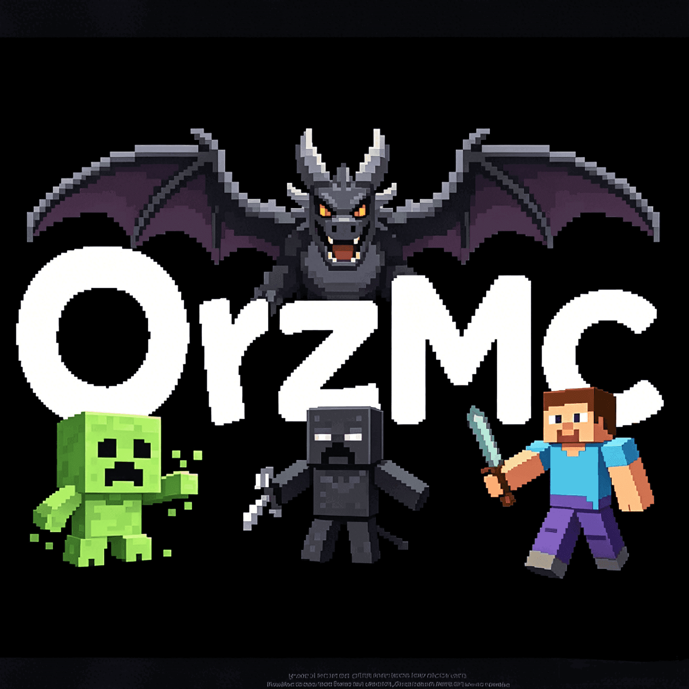

# OrzMC

  

  一个面向小范围社区协作与创造的 Minecraft 服务器组织

## 关于我们

OrzMC 致力于维护一个稳定、友好、长期运营的 Minecraft 玩家社区，核心服务端基于 `PaperMC`。  
我们希望为热爱生存、建造、联机协作的玩家提供一个相对纯净的环境，让大家能够专注于创造、探索和社区互动。

本组织坚持非商业化社区定位，遵守 Mojang EULA，目标不是做大规模公开服，而是经营一个有秩序、有交流氛围的小型玩家社群。

## 服务器特点

- 基于 `PaperMC` 构建，兼顾生态成熟度、可维护性与扩展能力
- 采用强制白名单机制，优先保障社区环境和服务器安全
- 提供国内服与海外服，降低不同地区玩家的联机门槛
- 国内服与海外服物理隔离，地图分别独立，互不影响
- 海外服支持按需自动启动与自动停止，减少资源浪费

## 加入方式

由于主页公开后服务器地址容易暴露，为了降低被恶意破坏的风险，OrzMC 采用审核制白名单策略。

加入流程如下：

1. 先加入玩家社区群组。
2. 向管理员提交白名单申请。
3. 提供你的 Minecraft 玩家用户名。
4. 审核通过后加入服务器游玩。

如果你希望获得最新的服务器地址、加入说明和社区入口，请前往主页查看：

- [Joker@Minecraft](https://minecraft.jokerhub.cn/)

## 运维理念

我们重视长期运维中的几个核心问题：

- 服务器稳定性与备份可靠性
- 插件选型与兼容性控制
- 地图体积增长带来的存储与备份压力
- 社区秩序维护与破坏行为防范

围绕这些目标，OrzMC 也会持续整理与沉淀 Minecraft 服务端运维、插件管理和 `PaperMC` 插件开发相关内容。

## 这个组织会放什么

这个 GitHub 组织主要用于整理和维护与 OrzMC 相关的内容，包括但不限于：

- 服务器配置与运维脚本
- 自研插件与工具项目
- 文档、经验总结与问题记录
- 面向社区协作的配套资源

## 支持项目

如果你喜欢这个社区，并希望它长期稳定运行，欢迎通过社区公布的方式支持服务器运营。  
所有支持都应当用于服务器相关成本，并保持公开透明。
